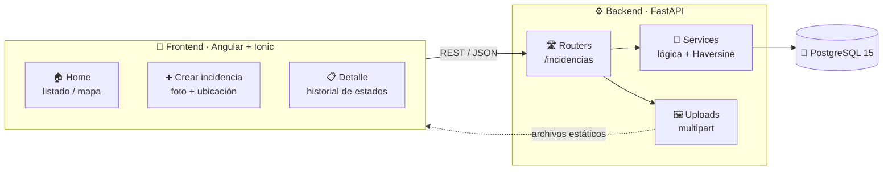

<!-- ╔══════════════════════════════════════════════════════════════╗ -->
<!-- ║                        HERO  ·  URBAN ALERT                    ║ -->
<!-- ╚══════════════════════════════════════════════════════════════╝ -->

<div align="center">

<a href="https://github.com/me58-ua/urban-alert">
  
</a>

<br/>


<br/><br/>

<!-- Status badges -->


</div>

---

## 🌆 ¿Qué es Urban Alert?

> **Urban Alert** es una plataforma digital **web/mobile** que permite a la ciudadanía **reportar incidencias urbanas** (baches, alumbrado defectuoso, basura, etc.) mediante **fotos**, **ubicación geográfica** y **categorización**, ayudando a las administraciones públicas a gestionar y **priorizar soluciones de forma eficiente y transparente**.

<div align="center">

| 👤 Ciudadano | 🏛️ Administrador Municipal | ⚙️ Sistema |
|:---:|:---:|:---:|
| Reporta y consulta incidencias | Gestiona estados y prioriza | Geolocaliza y registra historial |

</div>

---

## 🚀 Despliegue local

> Un único script (`script/deploy.ps1`) levanta **todo el stack** en `localhost`: la **base de datos PostgreSQL** en un contenedor Docker dedicado (`urban-alert-db`, puerto `5433`), el **backend** (FastAPI/uvicorn, puerto `8000`) y el **frontend** (Angular/Ionic, puerto `4200`), cada servicio en su propia ventana.

**🧰 Prerrequisitos**

- 🐳 **Docker** en marcha (Docker Desktop abierto).
- 🐍 **Python** disponible en el `PATH`.
- 🟢 **Node** + **npm** disponibles en el `PATH`.

```powershell
# 🚀 Desde la raíz del proyecto:
.\script\deploy.ps1

# 🔓 Si PowerShell bloquea el script por la Execution Policy:
powershell -ExecutionPolicy Bypass -File .\script\deploy.ps1
```

### ⚙️ Opciones principales

| Parámetro | Descripción | Por defecto |
|---|---|---|
| `-BackendPort` | Puerto del backend FastAPI | `8000` |
| `-FrontendPort` | Puerto del frontend Angular/Ionic | `4200` |
| `-DbPort` | Puerto host de PostgreSQL (contenedor) | `5433` |
| `-SkipInstall` | No instala dependencias | — |
| `-SkipDb` | No gestiona la base de datos | — |

### 🌐 URLs resultantes

- 📖 **API / Swagger**: http://localhost:8000/docs
- 📱 **Frontend**: http://localhost:4200

---

## 🏗️ Arquitectura



<div align="center">
<code>📱 Cliente</code> ⟶ <code>🌐 API REST</code> ⟶ <code>🧠 Lógica de negocio</code> ⟶ <code>🐘 Base de datos</code>
</div>

---

## ⚙️ Backend

> API REST construida con **FastAPI** aplicando **Test-Driven Development (TDD)** y desarrollo guiado por especificaciones (**OpenSpec**).

<div align="center">


</div>

| 🧩 Capa | 🛠️ Tecnología | 📝 Rol |
|---|---|---|
| **Framework Web** | FastAPI `0.135` + Uvicorn `0.42` | Endpoints REST asíncronos y docs OpenAPI |
| **Base de Datos** | PostgreSQL `15` (`psycopg2`) | Persistencia de incidencias y estados |
| **ORM & Migraciones** | SQLAlchemy `2.0` + Alembic `1.18` | Modelado y versionado del esquema |
| **Validación** | Pydantic `2.12` | Schemas de entrada/salida tipados |
| **Autenticación** | JWT (`PyJWT`) + `bcrypt` | Login, tokens y roles ciudadano/admin |
| **Configuración** | `pydantic-settings` (`.env`) | Secretos y ajustes por entorno |
| **Subida de archivos** | `python-multipart` | Imágenes `multipart/form-data` (validadas) |
| **Almacenamiento** | Local (volumen) / **S3** (`boto3`) | Persistencia de imágenes configurable |
| **Testing** | Pytest `9` + `pytest-asyncio` + SQLite `StaticPool` | Suite TDD en memoria (28 tests) |
| **Infraestructura** | Docker Compose | BD PostgreSQL reproducible |

```bash
# 🚀 Arranque rápido del backend
cd backend
docker compose up -d                 # 🐘 PostgreSQL
python -m venv venv && .\venv\Scripts\Activate.ps1
pip install -r requirements.txt
alembic upgrade head                 # 🗃️ migraciones
uvicorn main:app --reload            # 👉 http://127.0.0.1:8000/docs
pytest tests/                        # 🧪 tests
```

---

## 📱 Frontend

> Aplicación **híbrida web/mobile** construida con **Ionic + Angular** y empaquetable a nativo con **Capacitor**.

<div align="center">


</div>

| 🧩 Área | 🛠️ Tecnología | 📝 Rol |
|---|---|---|
| **Framework UI** | Angular `20` (standalone) | SPA y enrutado por páginas |
| **Componentes móviles** | Ionic `8` + Ionicons `7` | UI lista para mobile y web |
| **Build nativo** | Capacitor `8` (App, Haptics, Keyboard, StatusBar) | Empaquetado iOS/Android |
| **Lenguaje** | TypeScript `5.9` | Tipado estático |
| **Reactividad** | RxJS `7.8` | Streams y consumo de la API |
| **Testing** | Jasmine + Karma | Pruebas unitarias de componentes |
| **Calidad** | ESLint `9` + Angular ESLint | Linting y estilo de código |

```bash
# 🚀 Arranque rápido del frontend
cd frontend
npm install
npm start            # 👉 http://localhost:4200
npm test             # 🧪 tests (Karma)
npm run lint         # 🧹 ESLint
```

**Páginas principales:** 🏠 `home` · ➕ `crear-incidencia` · 📋 `urban-alert`

---

## ✨ Funcionalidades

<div align="center">

| | Funcionalidad | Descripción |
|:--:|---|---|
| 🔐 | **Autenticación JWT + roles** | Registro/login, tokens **JWT** y roles `ciudadano` / `admin` (contraseñas con bcrypt) |
| 📝 | **Reporte de incidencias (CRUD)** | Crear / listar / ver incidencias con foto, ubicación, categoría, descripción y prioridad |
| 📄 | **Listado paginado + filtros** | Paginación (`limit` / `offset`) y filtros por estado, categoría y prioridad |
| 🌐 | **Geolocalización (Haversine en SQL)** | Búsqueda de incidencias cercanas por `lat` / `lng` / `radio`, filtrada en la base de datos |
| 🔄 | **Gestión de estados (admin)** | `abierta` → `en_progreso` → `resuelta` / `rechazada`, protegido por **JWT** de admin |
| 🕓 | **Historial de estado y prioridad** | Auditoría automática de cada cambio, con valores anterior/nuevo |
| 🔔 | **Notificaciones** | Aviso automático al cambiar el estado de una incidencia |
| 🖼️ | **Imágenes validadas y persistentes** | Validación por *magic bytes* + tamaño; almacenamiento **local** (volumen) o **S3** |
| 📊 | **Métricas / dashboard (admin)** | Agregados reales: conteos, % resueltas, tiempo medio de resolución y reportes por periodo |
| 🛡️ | **Validación y moderación** | Saneo de textos y reglas básicas de moderación de contenido |
| 👥 | **Gestión de usuarios y roles (admin)** | Listar usuarios y promover a admin; *bootstrap* del primer administrador |
| ⚙️ | **Configuración por entorno** | Secretos y ajustes vía variables de entorno / `.env` (pydantic-settings) |

</div>

### 🔌 Endpoints principales

| Método | Ruta | Descripción |
|:--:|---|---|
| `POST` | `/auth/register` | 👤 Registro de ciudadano |
| `POST` | `/auth/login` | 🔑 Login → **JWT** (form `username` / `password`) |
| `GET` | `/auth/me` | 🪪 Usuario autenticado |
| `GET` | `/ping` | ❤️ Salud del servidor |
| `POST` | `/incidencias` | ➕ Crear incidencia |
| `GET` | `/incidencias` | 📋 Listar paginado (`limit`, `offset`) + filtros (`estado`, `categoria`, `prioridad`, `lat`, `lng`, `radio`) |
| `GET` | `/incidencias/{id}` | 🔍 Detalle + imágenes + historial |
| `PATCH` | `/incidencias/{id}` | 🔄 Actualizar estado/prioridad *(JWT con rol admin)* |
| `POST` | `/incidencias/{id}/imagenes` | 🖼️ Subir imagen `multipart` (validada) |
| `GET` | `/notificaciones` | 🔔 Listar notificaciones (`incidencia_id`, `leida`) |
| `PATCH` | `/notificaciones/{id}/leer` | ✅ Marcar notificación como leída |
| `GET` | `/stats` | 📊 Métricas / analytics para el dashboard *(solo admin)* |
| `GET` | `/users` | 👥 Listar usuarios *(solo admin)* |
| `PATCH` | `/users/{id}/rol` | 🔼 Cambiar rol / promover a admin *(solo admin)* |

> 📘 Guía de integración completa para el frontend (auth, esquemas, ejemplos): [`docs/integracion-frontend.md`](docs/integracion-frontend.md)

---

## 📁 Estructura del proyecto

```
urban-alert/
├── 📱 frontend/      → Ionic + Angular (web/mobile)
├── ⚙️ backend/       → FastAPI + PostgreSQL (API REST)
├── 📐 openspec/      → Especificaciones (spec-driven development)
├── 📄 PRD.md         → Documento de requisitos del producto
└── 📖 README.md      → Este archivo
```

---

## 🧭 Roadmap

| Fase | 🎯 Entregables |
|:--:|---|
| **MVP** ✅ | Reporte + listado + gestión básica |
| **Fase 2** ✅ | Notificaciones + login/autenticación **JWT** *(backend listo)* |
| **Fase 3** 🤖 | IA para priorización automática *(pendiente)* |
| **Fase 4** 📊 | Analytics y dashboard municipal *(endpoint de métricas `GET /stats` listo)* |

---

<div align="center">

### 💜 Hecho con FastAPI · Angular · Ionic


</div>
